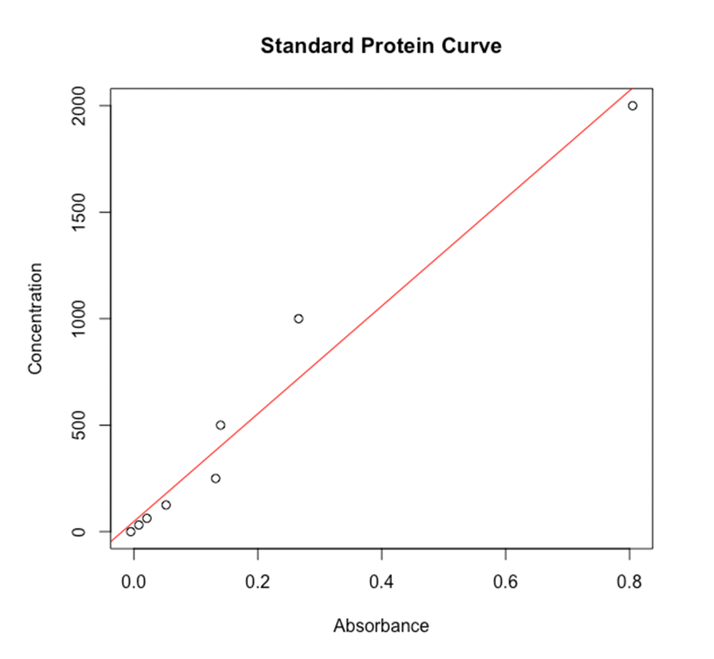
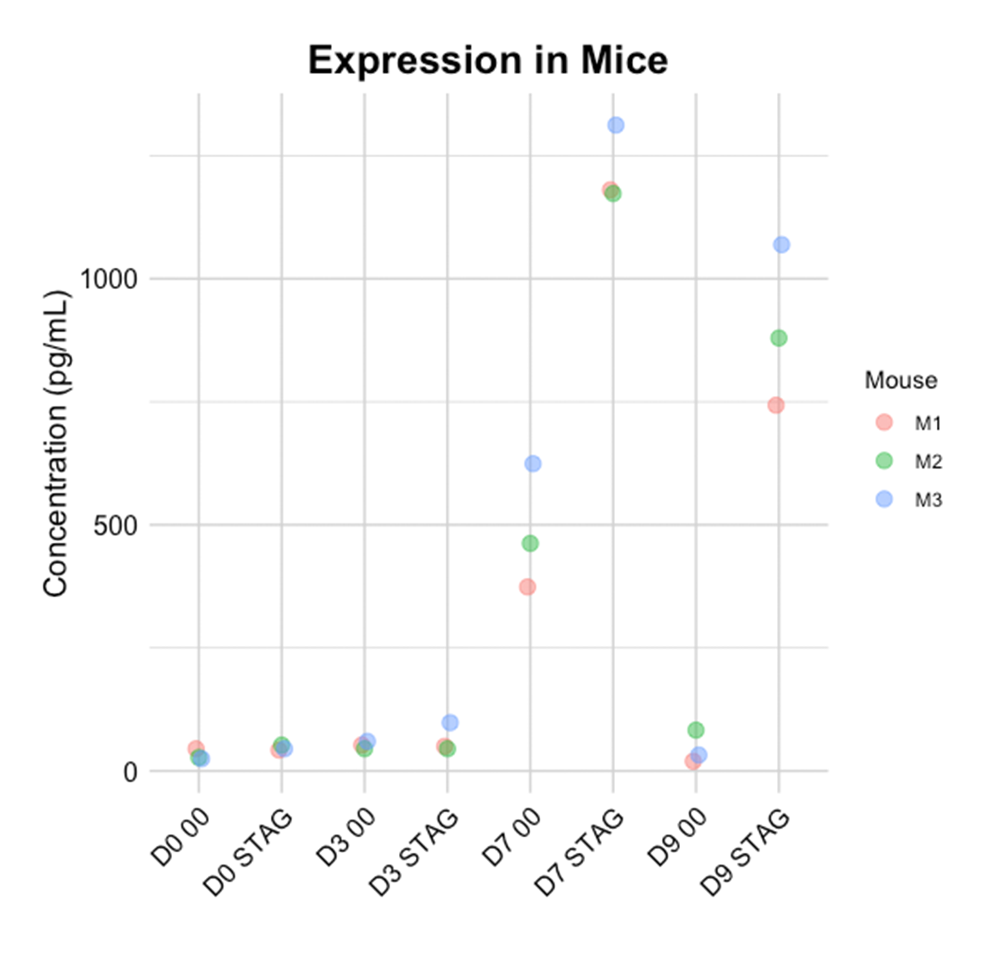
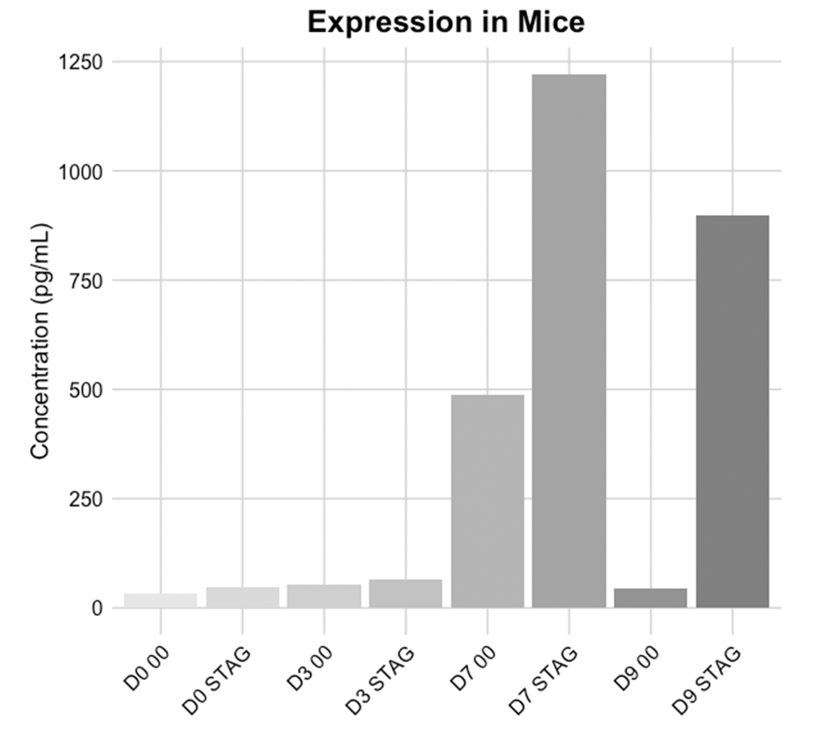

# Purpose
This program, written in R Quarto, is intended to predict concentrations of molecules in an ELISA (enzyme-linked immunosorbent assay) by optical density (OD). The predictions are dependent on a standard curve to inform the linear model. 

# Plots Produced

  

  

